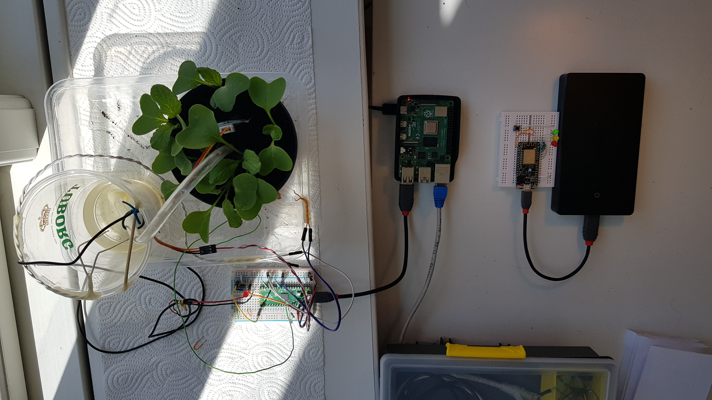
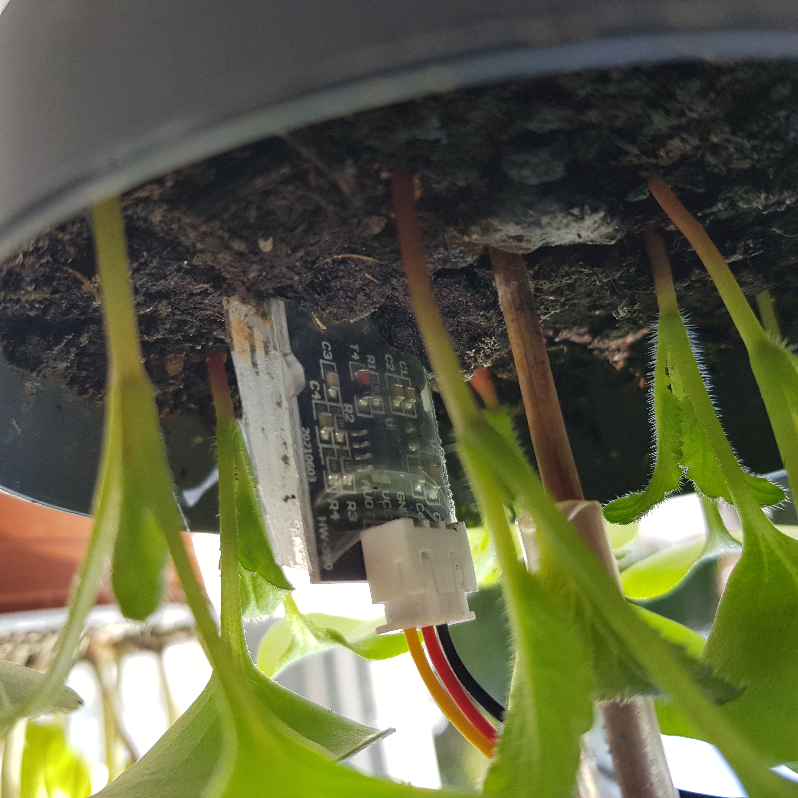
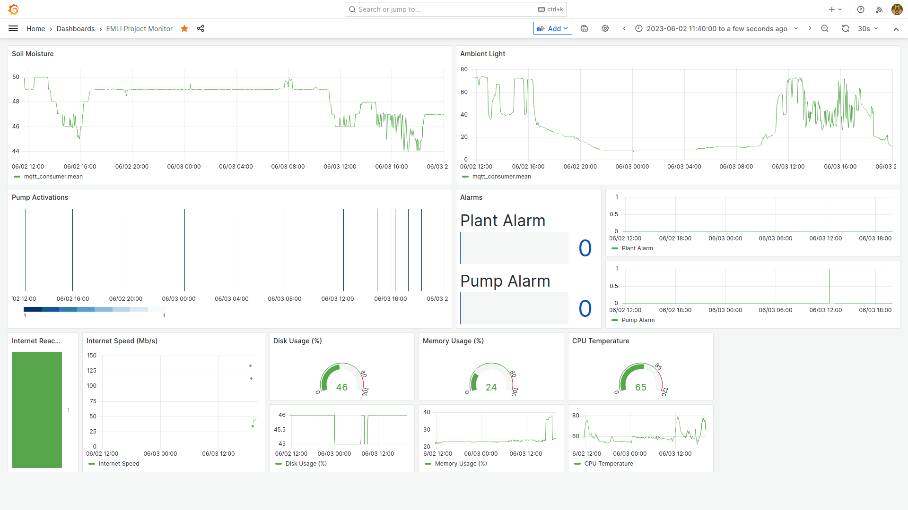

# Automated Plant Watering System
This is the repository containing the project for the "Embedded Linux" spring Semester 2023 course exam at SDU.
The project consists of an automated system for watering a plant (radishes in this case) while following other specified system requirements. The system makes use of:
* An RPI4, with an Ubuntu distro and the developed main application running
* A Raspberry Pi Pico microcontroller board for controlling each plant's hardware (the system is designed such that it can handle more plants with the same RPI, but a Pico is required for each plant)
* An optional ESP chip for manually controlling the pump and visualising the system status

Each plant has a soil moisture sensor, a photoresistor, a pump, and "alarm contacts" to sense whether or not the pump has enough water and whether the plant is flooded and water is spreading where it shouldn't.

Data is collected in a time series database (Influx DB) and displayed with the aid of Grafana. 

MQTT has been chosen as a messaging system (since MQTT clients can easily be implemented on the ESP). Mosquitto runs locally on the RPI and connection between the ESP and RPI is possible by configuring the Pi WiFi interface as an access point.

## Modules
The system is engineered as an actor model. The actors (or "modules") interactions are summarized by the following diagram. Each module has it's own bash script (under the _/modules_ dir).

## Configuring and running the system
A setup script (_rpi_setup.sh_) has been provided to install and configure the needed packages (made exception for the Graphana dashboard).
Reproducing the current setup _should™®℠©_ be as easy as:
* Clone the repo and cd into the project dir
* Programming and connecting the Pico via USB (Thonny has been used for that)
* Executing the _rpi_setup.sh_ installation script
* Programming the ESP (optional... the system will work even without it)
* Import the dashboard in Grafana (that should already be running on port 3000)

## Good to know
All the module are launched and managed by the _launcher.sh_ script. This script is in turn managed by Systemd, and gets executed at system startup. You should be able to manage the thing by means of the systemctl command:
    
    sudo systemctl status plantWatering.service