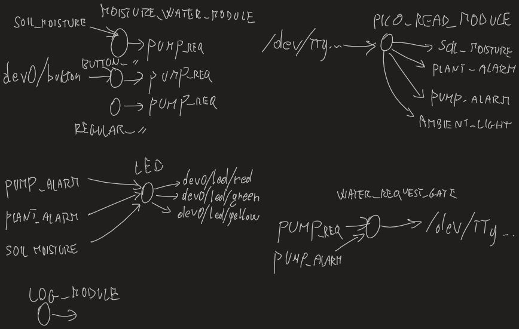

# Automated Plant Watering System

Our Project designed for the Embedded Linux Course at SDU in the Spring Semester 2023

## Modules
The modules were designed according to the following diagram. Each module performs an isolated task

### PICO Read Module
Reads serial input from PICO and outputs data to appropriate topics
- [x] In Progress
- [x] Done

### Water Request Gate
Reads the .../pump_request topic and .../water_alarm topic. If there is no alarm and a request, it signals the pump to activate
- [X] In Progress
- [x] Done

### Regular Water Module
Every 12 hours, request to pump
- [X] In Progress
- [X] Done

### Moisture Water Module
Read .../soil_moisture topic. If low, request to pump with a frequency of once in an hour
- [X] In Progress
- [X] Done

### Button Water Module
If the .../button_count is one, request to pump
- [X] In Progress
- [X] Done

### LED Module
if Water alarm or plant alarm, light RED
else if Moisture Low, YELLOW
else GREEN
- [ ] In Progress
- [ ] Done

### Log Module
Log system health data to mqtt
- [X] In Progress
- [X] Done
- [ ] Tested (cpu temperature works?)

## Graphana Interface
Show logged info on Graphana Dashboard
- [ ] In Progress
- [ ] Done

